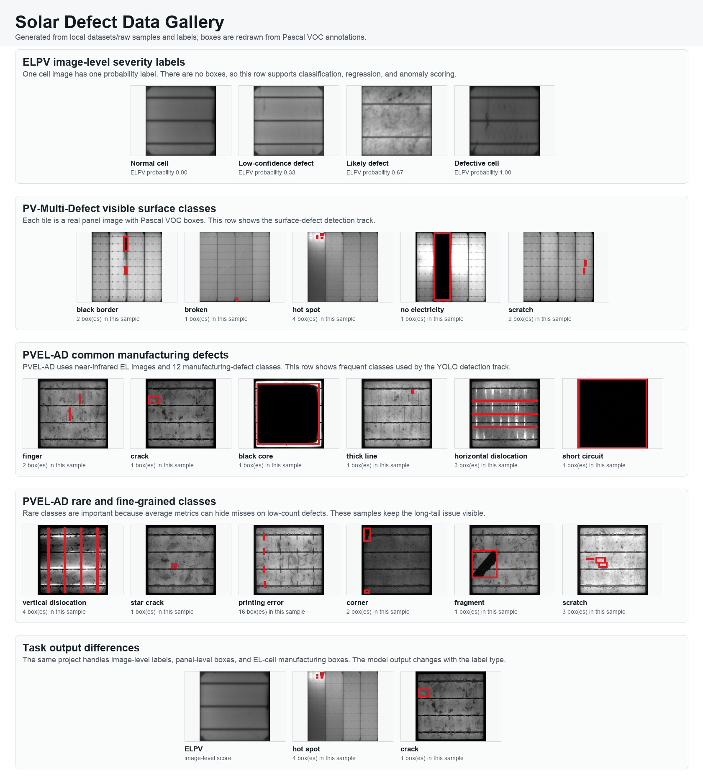
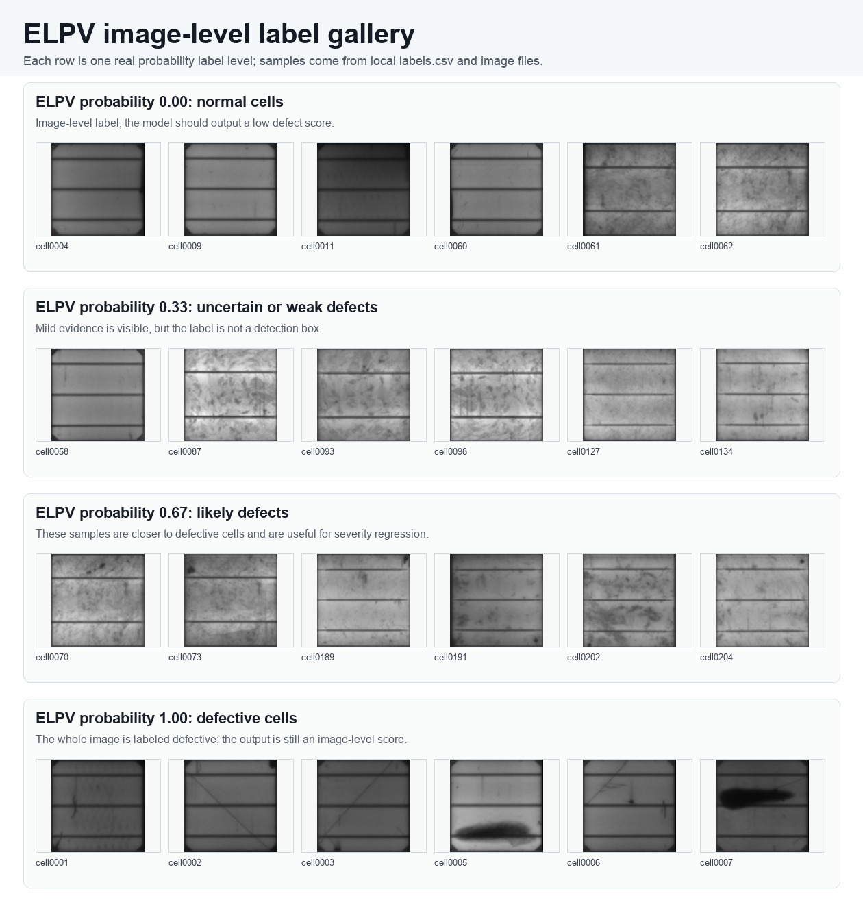
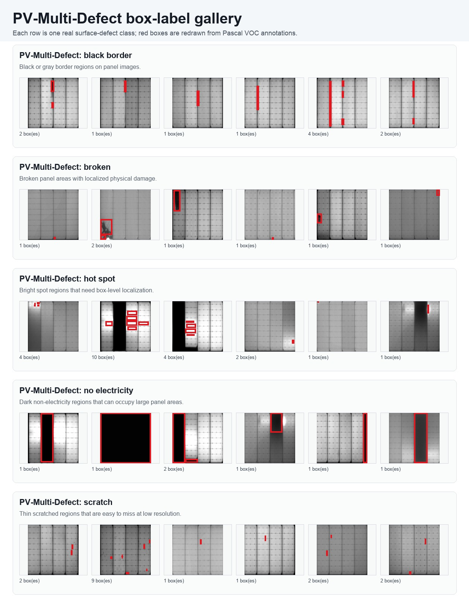
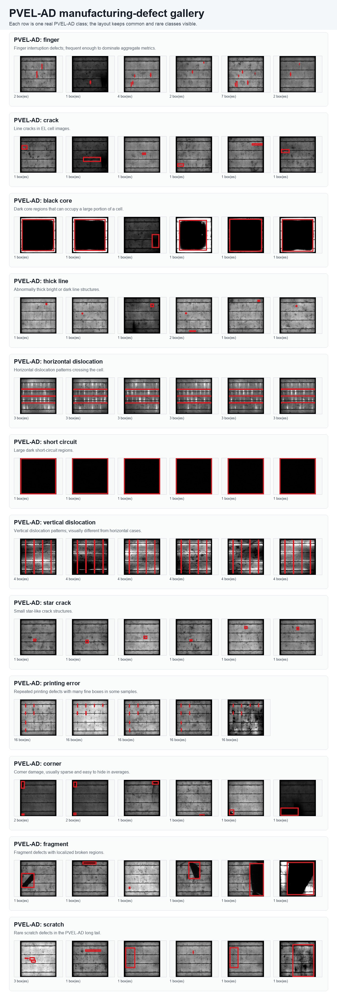

# AI Solar Panel Defect Detection Deployment

文档站地址：https://billzi2016.github.io/AI-Solar-Panel-Defect-Detection-Deployment/

这个项目围绕光伏电池片和光伏组件的缺陷检测展开。它的目标不是只训练一个模型，而是把数据整理、缺陷识别、异常发现、推理部署和文档说明放在同一个可维护的工程里。

项目当前已经包含数据集统计、VOC 到 YOLO 格式转换、YOLO 检测实验、ELPV 图像级 baseline、部署导出工具，以及中英文 MkDocs 文档站。

## 真实数据 Gallery

下面的 README 图片都由本地真实数据生成。脚本会从 `datasets/raw/elpv-dataset` 读取 ELPV 标签，从 `datasets/raw/` 读取 PV-Multi-Defect 和 PVEL-AD 的 Pascal VOC 标注，重新绘制真实框，并把 JPG 保存到 `assets/diagrams/`。

### 总览图



`readme_dataset_gallery.jpg` 是压缩总览图。它把主要任务维度放在一张图里：ELPV 图像级标签、PV-Multi-Defect 表面缺陷框、PVEL-AD 高频类别、PVEL-AD 稀有类别，以及分数输出和目标框输出的差异。

生成命令：

```bash
python3 assets/diagrams/build_readme_overview_gallery.py
```

### ELPV 概率维度



这张图按 ELPV 的真实图像级概率标签分组。每一行是一个概率值，每一行包含多张真实样本。ELPV 没有目标框，所以这一维度对应分类、回归或异常打分，而不是目标检测。

### PV-Multi-Defect 类别维度



这张图按 PV-Multi-Defect 的可见表面缺陷类别分组。每一行是一个类别，红框来自原始 Pascal VOC 标注的重新绘制。按行看多个真实样本，可以更直观看出不同表面缺陷的形态差异。

### PVEL-AD 类别维度



这张图按 PVEL-AD 的制造缺陷类别分组。每一行对应 12 类中的一类。高频类和稀有类都单独展示，因为总指标可能掩盖低样本类别的召回问题。

生成三张维度图：

```bash
python3 assets/diagrams/build_readme_dimension_galleries.py
```

## 项目要解决什么

光伏制造和运维中常见的图像来源包括 EL 图像、PL 图像、红外热成像和可见光图像。不同图像对应的缺陷不完全一样：EL 图像更适合看电池片内部裂纹、断栅和暗区；红外图像更适合看热斑；可见光图像更适合看表面破损、遮挡和脏污。

本项目先聚焦公开数据集中最容易复现的 EL 缺陷检测。核心任务包括：

1. 检测缺陷位置：输入一张电池片图像，输出缺陷框、类别和置信度。
2. 判断缺陷严重程度：输入一张单体电池片图像，输出正常、可疑或异常等级。
3. 发现未知异常：只用正常样本学习正常纹理，推理时找出不符合正常模式的区域。
4. 优化推理速度：把训练好的模型导出到 ONNX 或 TensorRT，比较精度和延迟。

## 数据集

项目围绕三个公开数据集组织。

| 数据集 | 图像类型 | 主要用途 | 输出目标 |
|---|---|---|---|
| PVEL-AD | EL 图像 | 多类别目标检测 | 缺陷框、类别、置信度 |
| ELPV | EL 图像 | 分类、回归、异常检测 | 缺陷概率或异常分数 |
| PV-Multi-Defect | 光伏缺陷图像 | 表面缺陷检测 | 缺陷框、类别、置信度 |

数据集不会进入 git。原始数据放在本地 `datasets/raw/`，清洗后的训练数据放在 `datasets/processed/`，这两个目录都由 `.gitignore` 忽略。

## 方法路线

项目会保留三条算法路线。

检测路线使用 YOLO 类模型。输入是图像，输出是一个或多个缺陷框。它适合回答“缺陷在哪里”和“缺陷属于哪一类”。

分类路线使用 ResNet、EfficientNet 或 MobileNet。输入是一张电池片图像，输出是缺陷等级或缺陷概率。它适合做快速筛查，也适合处理 ELPV 这种只有图像级标签的数据。

异常检测路线使用 PatchCore 或类似方法。训练时只输入正常样本，模型学习正常图像的局部特征分布。推理时，如果某个区域和正常样本差异很大，模型会给出更高的异常分数。它适合处理新缺陷和样本很少的缺陷。

## 工程结构

文档站放在 `docs-site/`。中文文档放在 `docs-site/docs/zh/`，英文文档放在 `docs-site/docs/en/`。中文文件使用 `.zh.md` 后缀，英文文件不加语言后缀。

根目录 README 是项目介绍的内容源。文档站中的 README 页面通过 symlink 指向根目录 README，避免同一段内容维护两遍。

## 如何判断项目是否正常

文档站正常时，`mkdocs build -f docs-site/mkdocs.yml --strict` 应该能完成构建。严格模式会检查导航、页面引用和链接错误。

正常结果应包含：

- 数据检查报告能列出图像数量、类别分布和异常标注。
- 训练脚本能从配置文件读取数据路径和模型参数。
- 评估脚本能输出 mAP、Recall、F1、AUC 或延迟指标。
- 部署脚本能导出 ONNX，并能比较 PyTorch 和部署后端的输出差异。

## 文档

完整文档在 GitHub Pages 上维护：

https://billzi2016.github.io/AI-Solar-Panel-Defect-Detection-Deployment/

## 数据集统计

数据集审计内容放在 `data_tools/stats/`。这里说明 ELPV、PV-Multi-Defect 和 PVEL-AD 分别包含什么、适合什么任务、标签如何表示，以及怎么判断本地下载是否足够用于训练。

在项目根目录运行：

```bash
python3 data_tools/stats/build_dataset_report.py
```

## 实验

检测实验放在 `experiments/detection/`，使用 Ultralytics YOLO，不实现自定义检测器。先把本地 VOC 标注转换成 YOLO 目录：

```bash
python3 data_tools/converters/build_yolo_detection_dataset.py --dataset pvel_ad
```

然后在项目根目录运行正式 large 模型训练入口。默认脚本使用 `l` 配置。YOLO11 作为默认实验模型，YOLOv8 作为 baseline 保留，用来比较不同模型版本的结果。

```bash
./experiments/detection/yolo_train/train_yolo11_pvel_ad.sh
```

YOLOv8 baseline：

```bash
./experiments/detection/yolo_train/train_yolov8_pvel_ad.sh
```

Apple Silicon 可以通过 Ultralytics 和 PyTorch 使用 MPS：

```bash
DEVICE=mps ./experiments/detection/yolo_train/train_yolo11_pvel_ad.sh
```

PV-Multi-Defect 使用对应的正式脚本：

```bash
./experiments/detection/yolo_train/train_yolo11_pv_multi_defect.sh
```

本机资源有限时，运行 `./experiments/detection/run_all_yolo_n.sh`。

ELPV 图像级实验放在 `experiments/elpv/`，使用 torchvision ResNet-18 和 Swin-T baseline：

```bash
python3 experiments/elpv/run_torchvision.py train --config configs/elpv/resnet18_binary.yaml
```

## 部署

部署辅助工具放在 `deployment/`。YOLO checkpoint 通过 Ultralytics export API 导出：

```bash
python3 deployment/export_yolo.py \
  --model outputs/detection/pvel_ad_yolo11l/weights/best.pt \
  --format onnx \
  --imgsz 640
```

ELPV torchvision checkpoint 使用对应配置导出 ONNX：

```bash
python3 deployment/export_elpv.py \
  --config configs/elpv/resnet18_binary.yaml \
  --checkpoint outputs/elpv/elpv_resnet18_binary/best.pt
```
