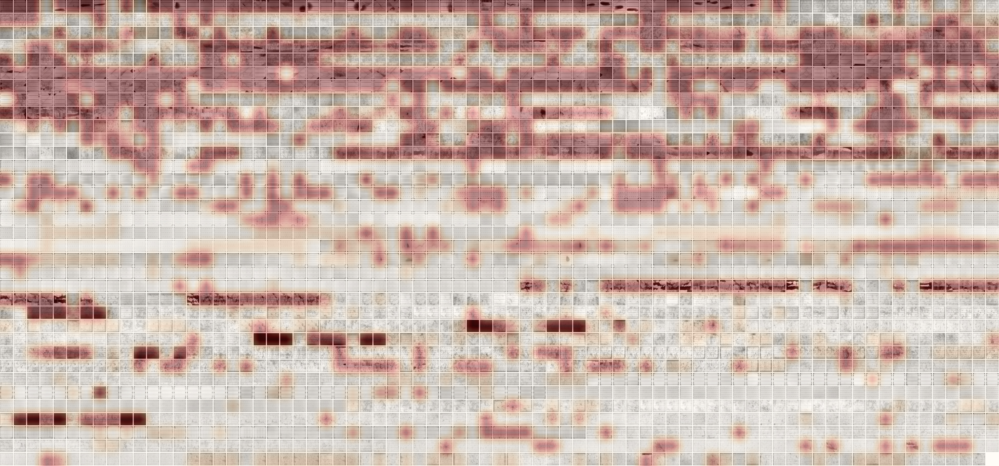
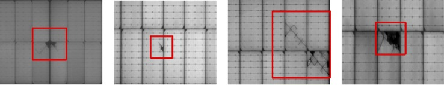
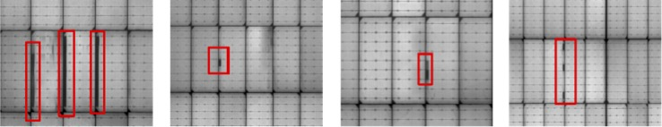
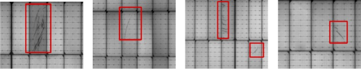
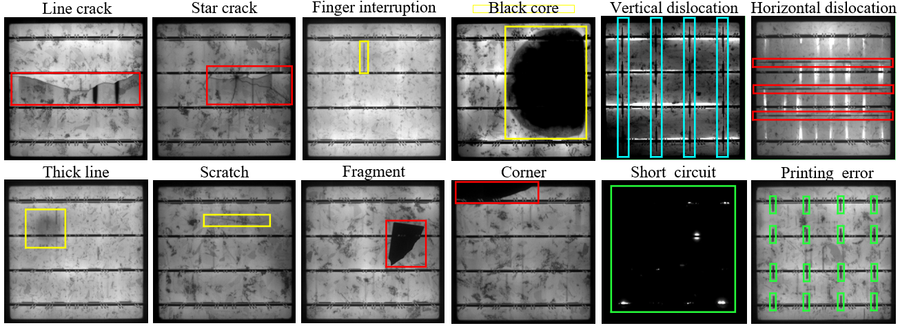

# Dataset Statistics Tool

This directory contains the dataset statistics tool and the report files it generates. Keeping the script, JSON summary, Markdown report, and small visual assets in one place makes the data audit easy to rerun and review.

Dataset parsing is shared through `data_tools/utils/`. The statistics tool imports ELPV, PV-Multi-Defect, PVEL-AD, and Pascal VOC helpers from that package instead of keeping private loader code inside this report folder.

## Dataset Scope

The project uses three public solar-defect datasets because each one answers a different modeling question.

| Dataset | Image type | Label type | Main task | What the model should output |
|---|---|---|---|---|
| ELPV Dataset | Single-cell electroluminescence images | One defect probability per image | Image classification or anomaly scoring | A probability, class, or anomaly score for the whole cell image. |
| PV-Multi-Defect | Panel images with visible surface defects | Pascal VOC bounding boxes | Object detection on panel-level defects | Box coordinates and defect class names for visible damaged regions. |
| PVEL-AD | Near-infrared EL cell images | Pascal VOC bounding boxes plus normal or auxiliary images | Long-tail defect detection and anomaly analysis | Box coordinates and one of 12 manufacturing-defect classes. |

### ELPV Dataset

ELPV is used when the question is whether a single solar cell looks defective. The input is a normalized grayscale EL image. The label is not a box; it is a defect probability such as `0.0`, `0.3333333333333333`, `0.6666666666666666`, or `1.0`. A normal result for this dataset is a clean image count, a readable probability distribution, and sample images that open as 300 by 300 cell crops.

### PV-Multi-Defect

PV-Multi-Defect is used when the question is where a visible panel defect appears. The input is a panel image. The label is one or more Pascal VOC boxes, with classes such as `broken`, `hot_spot`, `black_border`, `scratch`, and `no_electricity`. A normal result is a non-empty XML parse, class counts with visible imbalance, and sampled images where the defect class is visually plausible.

### PVEL-AD

PVEL-AD is used for the main long-tail detection track. The input is a near-infrared EL image of a photovoltaic cell. The released box labels cover 12 defect classes: `finger`, `crack`, `black_core`, `thick_line`, `horizontal_dislocation`, `short_circuit`, `vertical_dislocation`, `star_crack`, `printing_error`, `corner`, `fragment`, and `scratch`. A normal result is a full image count of 36,543, released VOC annotations for the trainval and test subsets, and a class table where frequent classes and rare classes are both visible.

## What It Does

`build_dataset_report.py` reads the local datasets under `datasets/raw/` and produces:

| Output | Path | Purpose |
|---|---|---|
| Machine-readable statistics | `dataset_stats.json` | Lets later training or validation scripts reuse the same counts. |
| English report | `dataset_report.md` | Explains the dataset scale, label formats, class distribution, and sanity checks. |
| Chinese report | `dataset_report.zh.md` | Same report for Chinese documentation. |
| Generated figures | `assets/` | Bar charts and sampled image grids created from local files. |
| Source examples | `datasets/raw/...` | A small allowlisted set of original project images kept for documentation display. The full datasets remain ignored. |

## Original Project Images

This section keeps a small set of original display images from the dataset projects in `datasets/raw/`. They provide source-level visual context before the generated statistics and sampled grids.

### From ELPV Dataset

The ELPV project describes the dataset as solar-cell crops extracted from high-resolution electroluminescence images of photovoltaic modules. It contains 2,624 normalized 300 x 300 grayscale samples from 44 modules. Each sample has a defect probability between 0 and 1 and a module type label, either mono- or polycrystalline.



Source description: the ELPV overview colors cell images by defect likelihood. A darker red overlay means a higher probability that the solar cell contains a defect.

### From PV-Multi-Defect

The PV-Multi-Defect project provides panel images in `JPEGImages/` and Pascal VOC labels in `Annotations/`. Its source README describes five visible defect examples: broken areas, bright spots, black or gray border areas, scratches, and non-electricity black areas.



Source description: photovoltaic panels with broken areas.


Source description: photovoltaic panels with obvious bright spot areas.



Source description: photovoltaic panels with black or gray border areas.



Source description: photovoltaic panels with scratched areas.


Source description: photovoltaic panels that have non-electricity regions and show black areas.

### From PVEL-AD

The PVEL-AD project describes a large near-infrared EL dataset for photovoltaic cell anomaly detection. It contains 36,543 images, anomaly-free samples, and anomalous samples from 12 defect categories. The released annotations make it a long-tail object detection task, because frequent classes such as finger interruption appear much more often than rare classes such as scratch or fragment.



Source description: the PVEL-AD project presents the dataset as a photovoltaic electroluminescence anomaly detection dataset with anomaly-free cells and 12 defect categories, including crack, star crack, finger interruption, black core, thick line, scratch, fragment, corner, printing error, horizontal dislocation, vertical dislocation, and short circuit.


Source description: the image is used by the PVEL-AD project to show the near-infrared EL visual style of photovoltaic cell defects. In this project it is kept only as a source-data reference image; generated sample grids and class-count plots are produced separately by `build_dataset_report.py`.

## How To Run

Run the script from the project root:

```bash
python3 data_tools/stats/build_dataset_report.py
```

The input is the local ignored dataset tree:

```text
datasets/raw/
```

The output is this directory:

```text
data_tools/stats/
```

The run is normal when it finishes without parser errors, `dataset_stats.json` is updated, and the Markdown reports show real images rather than broken links.
