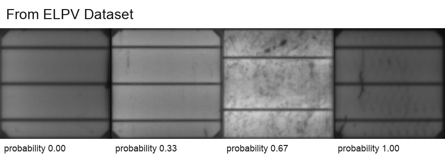
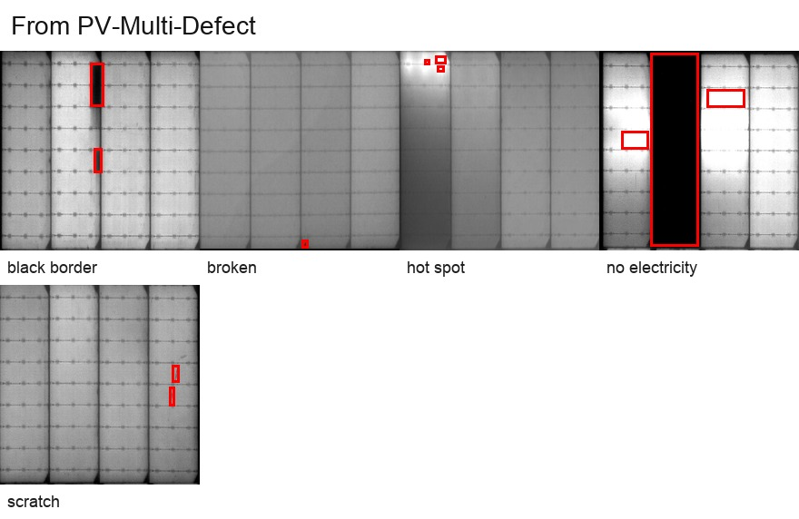
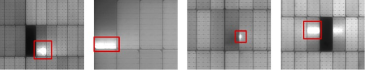
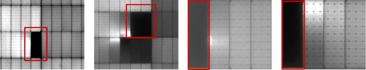
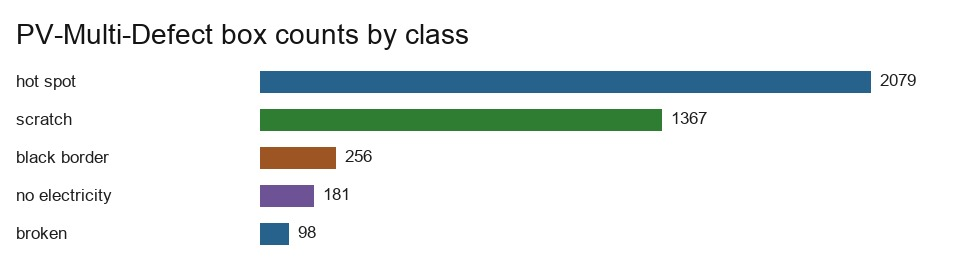
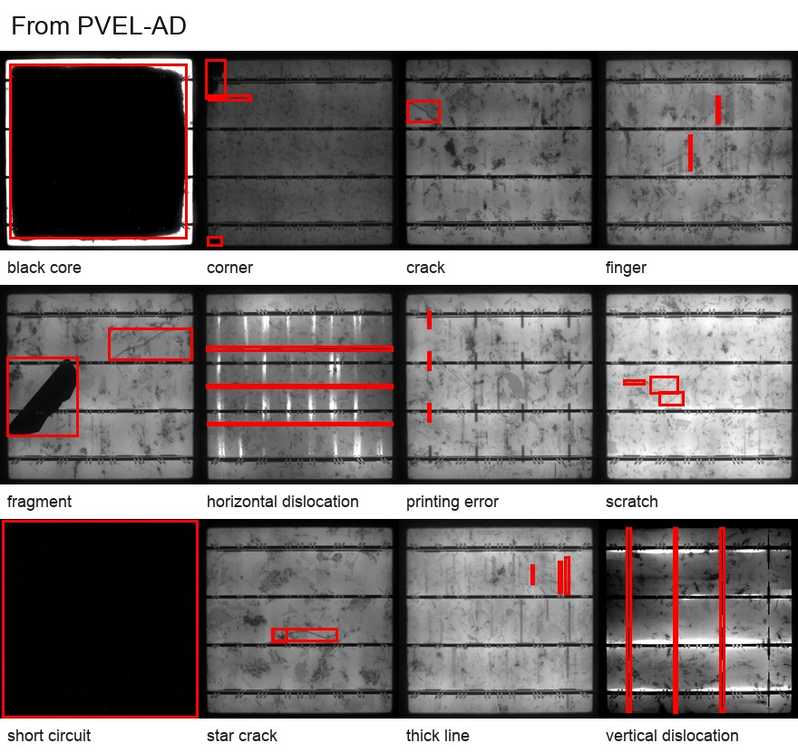
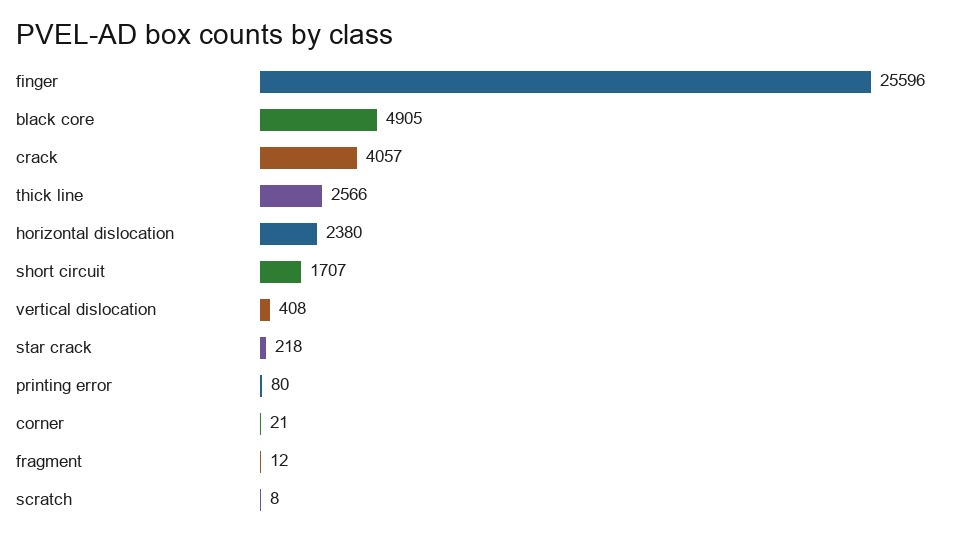

# 数据集统计报告

本报告由 `data_tools/stats/build_dataset_report.py` 从本机 `datasets/raw/` 中的真实数据生成。它统一记录图片数量、标注数量、类别分布和样例图，后续训练与部署文档都以这里的统计结果为准。

## 本报告检查什么

| 检查项 | 输入 | 输出 | 正常结果 |
|---|---|---|---|
| 文件发现 | 本机 `datasets/raw/` 目录 | 图片和标注数量 | 数量接近公开数据集的预期规模。 |
| 标签解析 | ELPV CSV 和 VOC XML | 概率、类别、框统计表 | 类别名可读，解析过程没有报错。 |
| 长尾分布 | 每类目标框数量 | 条形图 | 少数类能单独看见，而不是被平均值掩盖。 |
| 视觉核对 | 真实图片文件 | 小尺寸样例拼图 | 图片能正常打开，标签和可见缺陷大体一致。 |

## 数据集总览

| 数据集 | 本地输入 | 标注格式 | 已统计图片 | 已统计标签单位 |
|---|---|---|---:|---:|
| ELPV Dataset | `datasets/raw/elpv-dataset` | CSV 缺陷概率 | 2624 | 2624 个概率标签 |
| PV-Multi-Defect | `datasets/raw/pv_multi_defect` | Pascal VOC XML 框 | 1106 | 3981 个目标框 |
| PVEL-AD | `datasets/raw/pvel_ad/extracted` | Pascal VOC XML 框 | 36543 | 41958 个目标框，覆盖 23650 张有框标注图片 |

## 来自 ELPV Dataset

ELPV 是单电池片级别的 EL 图像数据集。它不提供目标框，而是给每张图一个缺陷概率标签。这个标签适合做全图分类、概率回归或无监督异常检测的评估入口。

### ELPV 缺陷概率统计

| 缺陷概率 | 图片数 |
|---|---:|
| `0.0` | 1508 |
| `0.3333333333333333` | 295 |
| `0.6666666666666666` | 106 |
| `1.0` | 715 |

### ELPV 晶硅类型统计

| 晶硅类型 | 图片数 |
|---|---:|
| `mono` | 1074 |
| `poly` | 1550 |

## 来自 PV-Multi-Defect

PV-Multi-Defect 是面板图像上的目标框数据集。它更适合验证检测器能不能定位表面可见缺陷，而不是只判断整张图是否异常。

### 来自 PV-Multi-Defect 的原始示例图

### PV-Multi-Defect 各类别目标框数量

| 类别 | 目标框数量 |
|---|---:|
| `black_border` | 256 |
| `broken` | 98 |
| `hot_spot` | 2079 |
| `no_electricity` | 181 |
| `scratch` | 1367 |

## 来自 PVEL-AD

PVEL-AD 是本项目主要使用的长尾目标检测数据集。模型输入是近红外 EL 图像，输出是缺陷框和 12 类缺陷标签。

### PVEL-AD 各类别目标框数量

| 类别 | 目标框数量 |
|---|---:|
| `black_core` | 4905 |
| `corner` | 21 |
| `crack` | 4057 |
| `finger` | 25596 |
| `fragment` | 12 |
| `horizontal_dislocation` | 2380 |
| `printing_error` | 80 |
| `scratch` | 8 |
| `short_circuit` | 1707 |
| `star_crack` | 218 |
| `thick_line` | 2566 |
| `vertical_dislocation` | 408 |

### PVEL-AD 划分统计

| 划分 | 图片数 | 有标注图片数 | 目标框数量 |
|---|---:|---:|---:|
| trainval | 4500 | 4500 | 7842 |
| test | 19150 | 19150 | 34116 |

PVEL-AD 中还包含没有 VOC 框的正常图或辅助图。本地完整图片数是 36543；上表统计的是已经发布 VOC 框标注的图片。

## 怎么判断结果正常

如果 ELPV 的图片总数接近 2,624，PVEL-AD 的图片总数是 36,543，并且两个目标检测数据集都呈现明显类别不均衡，那么统计结果就是符合预期的。这里的不均衡不是错误，而是后续训练必须处理的问题：训练时要关注少数类召回率，采样和增强不能只服务高频类别，模型导出后还要单独检查推理速度和精度变化。
